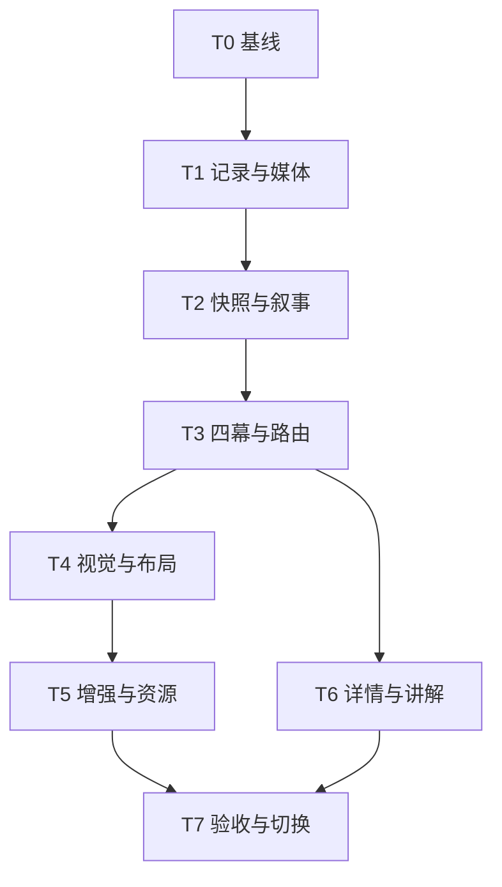

# ArtDuo experience 前端接入落地文档

本文定义将 `experience/` 的完整体验接入正式 `apps/web` 的实施方案，包括目标架构、文件归属、接口、交互状态、实施任务和验收门槛。用户已明确要求按本文落地，目标架构与关键接口据此作为实施基线；代码、自动化证据和仍未关闭的验收门槛记录在[接入验收记录](../reviews/artduo-experience-integration-acceptance.md)。所有 T0–T7 必需门槛关闭前，不视为接入验收完成。

对比结论、问题复现和截图单独保存在 [前端评估记录](../reviews/artduo-experience-review-2026-10-01.md)。执行时以本文为准。

**2026-10-03 用户调整：** 引导文案缩成一句，按参照减轻界面装饰，修复非画作混入的问题。入口提交直接展示首件；“本次展览”按需展开一句说明和阶段导航，显式 `phase=preface` 链接仍可打开无逐字等待的简短前言。画廊候选改为平面绘画、素描和版画；先按作品类型筛选，再做现有检索排序，不以器物、雕塑、建筑或摄影填满件数。此调整覆盖下文原先“首次强制前言”和“混合器物展览”的范围，其他架构和验收边界不变。

## 1. 交付目标与边界

最终交付一个正式 Next 应用：保留 experience 的情绪入口、前言、空间展厅、结语、展签、逐字叙事、光影、视差、转场、音频与分享，接入真实 release 馆藏、场景、情绪阶段和现有讲解能力，并补齐导航、错误恢复、手机布局和可访问性。

分步迁移用于验证依赖，不削减最终交付。以下能力全部完成并验收后，才能称为接入完成：

| 用户可见能力 | 完成定义 |
| --- | --- |
| 情绪入口 | 简短提问与一个输入区；键盘和触摸可提交，示例一键进入；提交立即准备并展示首件。 |
| 前言 | 一句与实际数量一致的引导，放在可选展览说明中；显式前言链接不等待逐字显示，只有一个观展按钮。 |
| 空间观展 | 保留留白、画框、灯光、场景层次和转场；主展览只选平面画作，画作题材包含建筑或器物不应被误排除。 |
| 情绪推进 | 使用现有动态 3–5 个 GrowthStage；阶段与作品数量分离，支持真实结果 0、1、5、12 件。 |
| 作品操作 | 可前后浏览、查看完整展签、放大、进入详细讲解、返回原位置；刷新、直达和浏览器返回可恢复上下文。 |
| 结语与分享 | 完成最后一件后进入结语；可回看、重新输入，生成并保存分享图；用户明确操作才生成分享产物。 |
| 音频与动效 | 保留听觉和视觉设计；音频由用户开启；减弱动效、媒体失败和 WebGL 不可用均有可用降级。 |
| 移动端 | 320px、390px、横屏及 200% 缩放下主要内容与操作均可达，无越界展签或强制整页裁切。 |

本次接入沿用现有检索、情绪协商与场景路线算法，不把原型的 12 件素材、三条手写弧或固定五件序列作为生产数据。原型更好的观感不能代替真实内容相关性验收。

本次不新增独立 Vite 生产站点、数据库会话持久化或浏览器 SSE 主链路；不更换检索算法或讲解提供方。现有服务端首屏检索和作品详情讲解足以支持目标。未来若要会话同步、在线新增作品或流式前言，应另行设计协议，不能把缺少这些接口当作本次接入的前提。

## 2. 现状与必须消除的差异

| 已核实的现状 | 实施约束 |
| --- | --- |
| 正式入口在 `apps/web`；已经存在真实检索、沉浸式页、图片代理、详情和放大组件。 | 在现有应用接入和复用能力，不从 legacy `frontend/` 重建运行链路。 |
| `experience/src/lib/contracts.ts` 是缩减镜像，含正式契约没有的深度图字段。 | 领域类型只从 `@artduo/contracts` 导入；表现层单独定义视图模型。 |
| `WebBackgroundScene` 丢失完整 `image_info`、`stage_profile`、`transition_profile`。 | 服务端保留经过解析的场景记录，不能从扁平标签猜测挂画区域。 |
| `buildAffectiveGrowthForm` 支持 3–5 阶段；当前真实检索默认上限为 12。 | 不使用 `curve[currentIndex]` 映射；按 artworkId 建立阶段关联。 |
| 当前协议事件仅有 `session.created/session.updated/explanation.updated/session.failed`。 | 不把原型 `preface_chunk/unit.ready` 当作既有正式接口。 |
| `apps/web/lib/curation-client.ts` 仍构造本地对象；API 目录有函数不等于有可用 HTTP/SSE。 | 首屏直接使用现有服务端检索快照，不伪造会话接入。 |
| pointer 单例、Room、CharReveal 在初始化或渲染时访问浏览器对象。 | 消除服务端执行时的 window/document 访问；仅加 `use client` 不够。 |
| 390px/320px 展签越界；数据失败出现黑屏；部分 GSAP 动画未遵循减弱动效。 | 全部列为切换默认入口前的必修项。 |
| `packages/ui/package.json` 与锁文件已不一致。 | 先修复清单与锁文件一致性，冻结安装通过后建立实施基线。 |

来源为仓库代码、既有需求/规范及 2026-10-01 本地评估；本文未使用外部资料。评估时的原型构建通过和局部浏览器检查，不计为接入实现的验收结果。

## 3. 目标架构与文件归属

```text
apps/web/app
  首页情绪入口 / 观展路由 / 详情 / loading / error
       │
apps/web/lib（服务端）
  同一 release → 画作类型筛选 → 现有检索 → 情绪阶段、场景路线、策展文案
       │
  experience-adapter → 可序列化 ExhibitionSnapshot
       │
packages/ui/src/experience（客户端表现与纯函数）
  Threshold → Walk / Room → Closing（Preface 保留为可选阅读）
  状态机、展签、音频、分享、响应式布局
       │
packages/ui/src/immersive（复用并统一）
  放大、媒体呈现、视差、转场
       │
apps/web 的媒体路径与 artwork 详情页
  图片/背景/音频；服务端按需加载完整讲解
```

| 文件或目录 | 操作与职责 |
| --- | --- |
| `apps/web/app/page.tsx` | 接入 Threshold；校验空输入，保留输入并立即导航；渲染模式由统一配置决定。 |
| `apps/web/app/gallery/page.tsx` | 保留当前画廊入口和 `view=route` 兼容行为；传递新版观展参数。 |
| `apps/web/app/gallery/[id]/immersive/page.tsx` | 服务端构建同一份真实数据，选择 classic 或 experience 呈现，解析恢复位置。 |
| `apps/web/app/gallery/[id]/immersive/loading.tsx`、`error.tsx`（新增或补齐） | 显式准备状态、失败反馈、重试与回到入口。 |
| `apps/web/lib/release-catalog.ts` | 保留类型完整的场景及必要作品记录，兼容当前调用方。 |
| `apps/web/lib/experience-adapter.ts`（新增） | 生成快照、校验引用、绑定阶段、生成媒体路径；无 React 状态或动画。 |
| `apps/web/lib/experience-navigation.ts`（新增） | 唯一 URL 构造/解析入口，校验 release 与返回路径，保留筛选与位置。 |
| `apps/web/lib/experience-config.ts`（新增） | 统一默认呈现与预览开关；两种视图共用数据和详情，不分叉算法。 |
| `apps/web/lib/curation-narrative.ts`、`affective-negotiation.ts`、`gallery-route.ts` | 复用现有能力；只增加接入所需的短文案与视图适配，保持选集和排序语义。 |
| `packages/ui/src/experience/{types,state,layout,motion-policy}.ts`（新增） | 纯类型、状态迁移、可测试布局计算、统一动效政策。 |
| `packages/ui/src/experience/{experience-shell,threshold,preface,walk,room,closing,plaque,char-reveal,audio-controller,share-card}.tsx`（新增） | 从原型逐项迁移表现；组件不读取 release、不调用模型、不依赖 Next 路由。 |
| `packages/ui/src/experience/{emotion-rail,atmosphere-layer,threshold-shader}.tsx`（新增） | 迁移阶段轨迹、环境层与入口效果；从正式阶段信号推导，不遗留固定五点曲线。 |
| `apps/web/components/experience-transition-host.tsx`（新增）、`app/layout.tsx` | 保留跨路由的短暂入口退场层，让数据请求与动画并行；仅在体验入口启用，结束/取消后卸载。 |
| `packages/ui/src/experience/experience.css`（新增） | 迁移版式、字体、色彩和动效样式，限定在 `.artduo-experience` 内。 |
| `packages/ui/src/immersive/` | 复用放大与作品分类呈现，合并视差和转场实现，保持旧组件接口兼容。 |
| `apps/web/app/artwork/[id]/page.tsx` | 保留完整详情；图片/元数据先显示，讲解置于独立异步边界；返回原展览位置。 |
| `apps/web/app/artduo-artwork/[id]/route.ts` 与对应图片 URL helper | 图片请求携带并验证 releaseVersion，与快照一致。 |
| `packages/contracts/src/artwork.ts`、pipeline 媒体构建链 | 增加可选且有版本的深度图元数据，支持缺失时降级；不复制原型契约。 |
| `packages/ui/src/index.ts`、`packages/ui/package.json`、`apps/web/next.config.*`、`apps/web/app/layout.tsx`、`pnpm-lock.yaml` | 导出、必要依赖、UI 包转译与局部样式接入。 |

原型组件和资产是设计参照。不要整体复制 Tailwind 配置、全局 reset、`overflow:hidden` 或 `import.meta.env.BASE_URL`；正式应用继续使用当前样式体系，资源通过已有路径解析。

## 4. 数据接口与一致性

### 4.1 快照接口

以下为拟新增的内部表现接口，放在 `packages/ui/src/experience/types.ts`。它不是新增的公共会话线协议，也不替换 `ExhibitionUnit`。

以下字段表用于确认数据边界；实施时复用正式类型定义，不照表另造领域模型。

| 模型 | 字段与语义 |
| --- | --- |
| ExhibitionSnapshot | schemaVersion=1；recipeVersion=experience-v1；releaseVersion、exhibitionId、query、title；preface/closing 为 NarrativeBlock；stages 为 ExperienceStage 列表；units 为 ExperienceUnit 列表；omittedUnitCount 记录不可用记录剔除数量。 |
| ExperienceUnit | exhibition 使用正式 ExhibitionUnit；artwork 取 ArtworkRecord 的 id/source/metadata/media/presentation；scene 为完整 BackgroundSceneRecord 或 null；stageId 为阶段引用或 null；caption 为 NarrativeBlock；media 为同源解析后的资源地址。 |
| ExperienceStage | 从 GrowthStage 保留 id、role、label、valence、arousal、tension、wonder、intimacy、intensity、transitionIntent；不把完整协商 trace 下发。 |
| NarrativeBlock | text 为可直接呈现的文本；source 为 grounded 或 fallback，用于区分有数据依据和中性兜底。 |
| 单元 media | previewUrl/fullUrl 必需；backgroundUrl/depthMapUrl 可选。媒体仍保留正式版本与指纹，不以解析后的 URL 替代版本校验。 |
| ExperiencePosition | preface 无作品位置；walk 必须有 unitId；closing 保留 lastUnitId，供刷新和回看恢复。空结果不构造 walk/closing 位置。 |

`ExhibitionSnapshot` 是本次检索完成后的完整清单；全部 units 一次交付，图片、动画与详细讲解各自加载。客户端不会因尚未到达的 SSE 单元误判结尾。空结果仍返回合法快照，走 empty 分支。

`ExperienceShell` 接收 snapshot、initialPosition 和事件回调；应用层负责 URL、重新检索、详情导航。不要把磁盘路径、provider 配置、检索向量、服务端缓存对象或完整协商 trace 序列化到客户端。

### 4.2 适配顺序与不变量

1. 解析 query 和 releaseVersion。未指定版本时解析一次当前 release，并将实际版本写回观展 URL；所有后续读取使用该版本。
2. 使用现有检索及场景路线得到正式展览单元，保持原有排序；构建当前情绪阶段与文案。
3. 按 `GrowthStage.artworkIds` 反查每件作品所属阶段。同一作品若出现在多个阶段，采用阶段列表中的首个并留下开发诊断；无匹配则 stageId=null，使用中性呈现，不用数组下标猜测。stages 保留全部 3–5 个阶段，轨迹按真实阶段展示、按当前 stageId 高亮；阶段没有作品时不伪造作品。
4. 单元顺序以现有场景路线输出为准，界面采用按件的阶段提示，不宣称每个阶段连续成组。本次不引入为凑情绪曲线而再次排序的算法。
5. 由真实 artworkId、sceneId 解析记录和媒体。重复 unitId 或非法顺序视为快照构建错误，不生成含混导航；缺失作品在构建快照前统一剔除，通过 omittedUnitCount 显示数量提示；其余作品顺序不变，无可用项则 empty。图片请求失败按媒体失败处理，不剔除已有元数据的作品。
6. 场景图片加载失败不移除作品；使用静态中性墙面。无可用场景记录时，保留域单元的必填 backgroundSceneId，view model 的 scene=null 并降级；不创建虚构场景记录。
7. 生成可序列化快照并验证 artworkId、unitId 唯一、引用一致、顺序稳定；恢复位置不存在时回到首个可用单元并提示。

`exhibitionId` 是 query、releaseVersion、recipeVersion 的稳定派生标识，仅标识本次组合，不是鉴权凭证或服务器保存的会话。相同版本和算法应得到相同顺序；它不承诺跨算法升级永久复现。

### 4.3 文案与讲解

- 前言和结语复用现有本地策展文案路径，依据本次情绪信号及实际入选作品生成。短文案不注入完整长英文标题；作品原名、作者与年代在展签和详情完整保留。
- 展签即时文字仅使用已有 `storySnippet/descriptionClean` 或可追溯的视觉、情绪标签；缺少证据时用中性观展提示，不能补写未经支持的故事或作品事实。
- 完整生成讲解通过现有 `/artwork/[id]` 详情访问。将现在整页等待讲解的方式拆为元数据/图片先渲染、讲解区独立 pending/ready/failed；复用现有服务端 provider 与缓存。
- 讲解失败时只替换讲解区，允许重试，作品和返回入口仍可用。此次不新建浏览器直接调用模型的接口。
- 默认文案不保证“疗愈”或将情绪理解说成事实；固定测试包含疲惫、低落、明亮、无情绪关键词、长输入及中英混合输入。

### 4.4 媒体与深度图

- 作品图片使用现有同源 `/artduo-artwork/[id]` 路径，新增 releaseVersion 参数，并在 loader 和代理共同验证。版本只能来自实际可用 release 的合法标识，不能直接拼接客户端路径。
- 背景和音频沿用 `/artduo-gallery/[...path]`、`/ambient-audio/[...path]` 的受控映射。资源不存在时降级，不从 demo JSON 兜底。
- 在 `ArtworkMediaRefs` 增加可选 `depthMap` 对象，字段为 `url`、`version`、`sourceAssetFingerprint`、`method: "estimated" | "model"`；同步 parser、fixture、mediaIndex 序列化和加载测试。
- 深度图必须与同一作品底图、裁切及版本对应；通过受控媒体映射提供同源 URL。缺失、错版或加载失败时静态显示，不能阻断作品。
- 不覆盖已发布 release；由现有 pipeline 生成新版本媒体记录。无需为全部馆藏预先生成深度图才允许浏览，但静态降级及有图样本的视差效果都必须验收。
- 有图验收样本使用已授权底图及可追溯的深度图；若当前只有原型估算能力，把其中无联网的估算步骤提为 pipeline 的独立生成函数，输入/输出路径由任务参数提供，记录 method=estimated 与底图指纹，不临时引入付费生成服务。
- `scripts/prepare-experience-assets.py` 含本机绝对路径和基于亮度/径向的估算图，仅为原型脚本；不直接执行或作为正式生产流水线，也不把其输出称为真实深度测量。

## 5. 路由、状态机与恢复

### 5.1 路由约定

保留现有路径，以参数区分呈现，不开第二个正式应用。新增参数由 `experience-navigation.ts` 统一处理。

| 路径/参数 | 行为 |
| --- | --- |
| `/?view=experience` | 同应用内预览新版入口；预览期间默认仍为当前首页。 |
| `/gallery/local/immersive?query=…&view=experience&releaseVersion=…&recipeVersion=experience-v1&phase=preface` | 显式前言直达；一句说明立即呈现，可直接开始观展。首次提交使用 `phase=walk`。 |
| 同一路径，`phase=walk&artworkId=…` | 使用既有 artworkId 查询惯例直达该作品；内部转换为 unitId。 |
| 同一路径，`phase=closing&artworkId=…` | 结语直达/刷新时保留最后浏览位置，可回看。 |
| 同一路径，`view=classic` | 强制当前沉浸式呈现；用于同数据对照和回退。 |
| `/artwork/[id]?releaseVersion=…&returnTo=…` | 完整详情；returnTo 只接受本应用画廊路径，拒绝外域或任意协议。 |
| `/gallery?view=route` | 保留既有路线视图，避免新增 view 参数破坏当前语义。 |

进入展览和进入详情使用正常导航；展内前后切换、跳过前言、回看使用 replace 更新当前 URL，避免每件作品占用一条浏览器历史。浏览器返回退出当前展览或从详情回到原作品，浏览器前进按 URL 恢复；刷新不会重新播放已经跳过的前言。

无效 phase/作品位置归一到首个可用单元；缺失或不可用 release 显示“此版本暂不可用”，提供使用当前版本重新策展的明确按钮，不静默混用新旧版本。recipeVersion 不受支持时同样提示重新策展。

此方案继承当前 query 入 URL 的方式，不新增持久化、远端情绪日志或在线分享会话。分享默认输出作品与策展文案，不把原始情绪输入自动写入图片或公共链接。

### 5.2 状态分层

| 状态层 | 值与责任 |
| --- | --- |
| RouteLoad | pending / ready / empty / failed；负责快照准备与恢复。 |
| Act | threshold / preface / walk / closing；负责当前幕。 |
| Navigation | idle / transitioning；只负责当前切换，完成或取消后解锁。 |
| UnitMedia | 每件分别 pending / ready / failed；场景失败与作品失败独立。 |
| Connectivity | online / offline；与已有快照是否存在分开，不覆盖 Act 或清空已展示的作品。 |
| Overlay | none / plaque / lightbox；详情页通过应用路由打开。 |
| Audio / Share | 音频 off/on/error；分享 idle/generating/ready/failed，各自独立。 |

核心迁移规则写入纯 reducer，动画结束不能作为业务状态能否继续的唯一条件：

| 当前状态 + 事件 | 结果 |
| --- | --- |
| threshold + SUBMIT | 校验有效输入后立即导航；准备页立即可见；拒绝重复提交。 |
| pending + RESOLVE | 非空进入 URL 指定幕；没有恢复位置时默认首件 walk，显式 phase=preface 才进入前言。 |
| pending + EMPTY / REJECT | 显示空结果或失败说明、重试与返回；不进入黑屏。 |
| preface + SKIP / CONTINUE | 转到首件；即使图片仍 pending 也有作品框、元数据和加载反馈。 |
| walk + NEXT / PREVIOUS | 依据 units 边界切换；末件 NEXT 才进入 closing；首件 PREVIOUS 不越界。 |
| transitioning + 再次导航 | 一次只接受一个目标；最多保留最后一个待执行方向，取消旧动画时清理锁。 |
| walk + MEDIA_FAIL | 当前作品显示可重试占位和完整展签；允许继续，背景失败只换墙面。 |
| 任意 + OFFLINE | 已有快照保留，已缓存媒体继续可看；未缓存媒体和讲解明确标示不可用。快照尚未取得时显示离线反馈，恢复网络后可重试；不承诺冷启动离线生成新展览。 |
| closing + REVISIT / RESTART | 返回最后浏览单元，或带原输入回首页编辑；不自动重新发起检索。 |
| 任意 + ROUTE_CHANGED / UNMOUNT | 取消动画、计时器和媒体工作，按新 URL 初始化；旧结果不得覆盖新展览。 |

首屏 10 秒仍未返回时显示“准备时间较长”及返回入口；20 秒仍未完成可显示重试入口。这是 UI 反馈阈值，不声称取消按钮能终止已经开始的服务端计算。重试及改写输入产生新请求标识，过期结果不得更新当前界面。阈值在实施性能基线中验证后统一配置。

partial 只表示“快照完整、部分媒体或讲解尚不可用”，不表示等待更多作品。沿用现有 analytics 边界补充本地计时与降级原因：release 加载、检索、场景匹配、首作品可见/可操作、讲解耗时及 fallback；不记录原始 query 到远端。既有 browser-local-runtime 路径及缓存能力继续通过原测试验证，不因新版默认入口而移除。

## 6. 表现层迁移要求

### 6.1 四幕和空间

| 原型来源 | 正式迁移要求 |
| --- | --- |
| `sections/Threshold.tsx` | 保留输入排版、氛围与进入动作；输入标签、提交状态、键盘 Enter 和错误反馈完整。 |
| `sections/Preface.tsx`、`components/CharReveal.tsx` | 保留叙事节奏；文字立即有完整可访问文本，视觉逐字层对读屏隐藏；跳过按钮始终可用。 |
| `sections/Walk.tsx`、`Room.tsx` | 保留空间构图和连续观展；将阶段、单元与渲染资源解耦；持续显示位置与前后导航。 |
| `components/Plaque.tsx` | 保留展签风格，同时支持长标题、长作者、多语言与完整元数据。 |
| `sections/Closing.tsx` 与音频/分享组件 | 保留结语、回看与分享流程；文案绑定真实选集，生成失败可重试，音频失败可静音继续。 |

`ExhibitionUnit.displayMode` 保持正式的 static-frame / motion-frame / director-focus；wall-painting / object-case / architecture-flat 是现有 UI 展示分类，两者独立。绘画沿用平面装裱；器物使用适配底座和完整轮廓；建筑使用平面展示，禁止默认套同一种壁挂框。

### 6.2 布局与可访问性

- 把挂画区域计算提为纯函数，输入 viewport、安全区、场景原始尺寸与 mount zone、作品纵横比、导航及展签占位，输出 frame/plaque 边界。
- 场景图采用 cover 时，先计算图像缩放和裁切偏移，再投影 normalized mount zone 到可见区域；与安全区求交后适配画框，不能直接拿 viewport 百分比代替图片坐标。
- 坐标必须有限且位于合法归一化范围。polygon 挂画区先求能容纳画框的内接安全矩形；不能直接用可能越出多边形的外接框。无法求得安全区域则居中静态降级；缺失图片尺寸时待图片解码取得尺寸，期间保留稳定占位。
- 画作同时受可用宽高约束，默认 contain 保持完整内容；裁切仅遵循已有 visualPresentation。挂画区不足时切安全的居中静态布局。
- 可用宽度不足 768px 时使用下方展签/可滚动抽屉，不采用“右边放不下就放左边”。桌面左右展签均需边界校验；画作、导航、展签不能互相挡住。
- 正文/展开展签建议至少 16px，元数据至少 14px，主要触达区至少 44×44px。默认较小的艺术标签必须同时提供可读展开入口，不以截断作为唯一信息来源。
- 弹层有名称、关闭按钮、Esc、焦点约束及关闭后焦点归位。Tab 不进入背景；键盘方向导航在输入控件内不触发观展切换。
- 200% 缩放及短屏允许内容区滚动；不以固定全局高度和 overflow:hidden 裁掉入口、文案或导航。
- 文字和按钮在不同背景下检查对比度；普通文字至少 4.5:1、大字及必要控件边界至少 3:1，可加局部衬底，不能仅凭暖色风格判断可读。

### 6.3 动效、媒体与资源

- `motion-policy.ts` 汇总 reduced-motion、指针能力和渲染能力。入口下沉、前言缩放、观展转场、结尾模糊、指针视差、逐字动画全部遵守。
- reduced-motion 下去掉位置/缩放/景深/循环视差，仅允许短淡入淡出或直接切换；文字直接显示完整内容。关闭音频不是 reduced-motion 的替代措施。
- 合并现有 `depth-parallax-renderer` 与原型实现，由一个模块管理 WebGL；沿用现有 contain、全图与裁切边界规则，避免重复创建 canvas 或两个渲染循环。
- 为正式七类转场建立 registry：fade、dissolve、match-cut、depth-push、lateral-pan、light-swell、scale-focus。未知或不支持的渲染能力降级为 fade；不能悄悄丢弃已支持的 hint。
- 只保留当前单元的活动渲染器，提前准备相邻作品图片；不为全展览同时开启 WebGL 或加载所有高清图。页面隐藏暂停循环，退出释放 texture、context、RAF、监听器、GSAP timeline 与计时器。
- window/document、matchMedia、指针 store、AudioContext 仅在挂载后初始化；SSR 先给出稳定静态结构，避免 hydration 跳动。
- 音频默认关闭；明确点击后播放，保留开关与音量设计；换曲渐变、退出停止，重入不叠加。使用已有允许的音频资源，实听验证首尾、切换和静音。
- 分享复用同源图片和可用字体生成画布；等待字体/图片就绪。分享内容含作品名、作者、来源及精选文案，长内容自动换行，原始输入默认不进入成品。图片失败给出可重试反馈及文字卡兜底；下载后检查实际文件。

## 7. 实施任务与完成门槛

以下 T0–T7 为依赖顺序，不是优先级分档。所有项都是本次接入完成条件；文件名为新增文件的实施约定，可按仓库命名习惯调整，但职责和验收不得消失。



依赖图表示可独立推进的代码职责，不代表已获 agent、分支或并行工作空间授权。

### T0：建立可重现基线

**前置：** 本文目标、模块和关键接口获得实施确认。

- [x] 核对当前工作区修改，复用现有工作空间，不自动创建分支、worktree、提交或发布。
- [x] 对齐 `packages/ui/package.json` 与 `pnpm-lock.yaml`；使用仓库指定 pnpm，确保冻结安装成功。
- [x] 保存 classic 的真实 query、releaseVersion、结果顺序和截图，建立同一数据的比较基线。
- [x] 运行现有测试、类型检查、构建及相关 E2E，记录真实失败；接入会用到的现有失败先定位，不能用原型构建成功代替。

**完成：** 干净安装可重现；基线与失败归因记录到拟新增 `docs/reviews/artduo-experience-integration-acceptance.md`。

### T1：打通正式记录与媒体契约

**依赖：** T0。**涉及：** `release-catalog.ts`、`packages/contracts/src/artwork.ts`、`packages/corpus/src/release-loader.ts`、图片代理、`apps/pipeline/src/release-artifact.ts`、`build-media-index.ts` 及对应测试；需要估算样本时新增 `apps/pipeline/src/depth-map.ts` 与 `depth-map.test.ts`。

- [x] 保留完整场景记录及作品字段，为旧调用方保留兼容映射，消除扁平对象强转领域类型。
- [x] 统一 releaseVersion 校验、loader 选版、图片 URL 与代理选版；版本不存在时失败可解释。
- [x] 补齐可选 depthMap 字段、解析、媒体索引输出和受控访问；旧 release 无该字段仍正常加载。
- [x] 使用新版本 fixture 验证底图/深度图绑定，坏地址与错版本降级；不批量重写或下载现有馆藏。

**完成：** 同一版本的数据和媒体端到端一致；旧 fixture 兼容；非法版本无法穿越 release 路径。

### T2：实现快照适配与真实叙事

**依赖：** T1。**涉及：** `experience-adapter.ts`、`experience/types.ts`、`curation-narrative.ts` 及现有检索/阶段/路线接入点。

- [x] 实现第 4 节接口，组合真实单元与已解析记录，不复制 demo datasource 或预设弧。
- [x] 按 artworkId 绑定阶段；保持既有顺序，支持空结果、单件、多件、阶段空桶及未分配作品。
- [x] 前言、即时 caption 和结语以真实选集生成；长标题进入元数据，不挤占主叙事。
- [x] 检查单元唯一性、缺失记录处理及完整清单语义；记录被剔除项数量的展示状态。
- [x] 添加适配器测试：0/1/5/12 件、3/4/5 阶段、长英文标题、缺场景、重复引用和稳定重建。

**完成：** UI 只凭快照即可浏览；无模型、音频、SSE 或深度图也能形成完整基本展览。

### T3：迁移四幕并接通路由

**依赖：** T2。**涉及：** 四幕组件、state、navigation/config、首页、观展页及 loading/error。

- [x] 添加 UI 包必要的共享契约依赖和 Next 转译；将原型样式转为局部 CSS，补齐 SSR 边界。GSAP 经检索确认未被实现使用，因此未添加为运行时依赖。
- [x] 在 `view=experience` 入口完成 Threshold → Preface → Walk → Closing，保留 classic 默认。
- [x] 实现 act/loading/media 等分层状态；跳过、重试、过期结果丢弃及导航解锁有明确路径。
- [x] 前后切换写回 URL；刷新、直达、详情返回、浏览器前进后退保留 query、release 与作品。
- [x] 保留结语回看、重新输入、空结果和失败出口；不显示开发用协议状态给用户。
- [x] 补齐 partial/offline 提示、10/20 秒准备反馈、首作品本地计时与降级原因记录；加载期间允许退出，不清空已到达的快照。

**完成：** 关闭动画和所有增强时完整流程可操作；真实数据失败不产生无反馈黑屏。

### T4：完成空间视觉、手机布局与动效

**依赖：** T3。**涉及：** Room、Plaque、layout、motion-policy、experience.css、现有 immersive 呈现/转场模块。

- [x] 按原型迁移画框、空间层次、光影、色彩和字体，不用普通卡片列表替代展厅。
- [x] 接入真实 mount zone 并计算 cover 裁切；布局计算覆盖常见作品比例，展示类别保留独立适配。
- [x] 完成下方展签/抽屉、完整元数据、短屏滚动、弹层焦点与键盘操作。
- [x] 七类转场均有实现或明确能力降级；四幕全部覆盖减弱动效。
- [x] 用同一真实快照对照原型的视觉意图，修正长文案、拥挤、越界与遮挡；Chromium 320/390/844 横屏/1440 自动截图通过。200% 缩放仍待人工验收。

当前验收边界：320/390/844 横屏/1440 已由 Chromium 自动检查；200% 浏览器缩放和实际触摸设备仍未人工验收，因此 T4 的最终完成门槛尚未关闭。

**完成：** 320/390px、桌面、横屏和 200% 缩放通过；无展签越界；新版视觉目标逐项有截图证据。

### T5：接入视差、音频、分享与资源回收

**依赖：** T4。**涉及：** 统一视差 renderer、媒体 helper、audio-controller、share-card。

- [ ] 验证有/无深度图、错误深度图、WebGL 不可用、context 丢失时的静态退路。
- [x] 当前作品与相邻预加载策略落地；快速切换、隐藏页面、退出重进均清理旧资源。2026-10-02 浏览器资源测试覆盖切换 20 次、组件卸载 / 重挂 3 次，活动 renderer 峰值 1，卸载后的 program / texture / RAF 为 0；实际手机后台行为仍属于设备验收。
- [ ] 迁移音轨与用户控制，实听确认无自动播放失败后的僵死状态或叠音。
- [x] 分享使用正式媒体路径；生成、下载及失败重试闭环可用；实际图中长标题完整且无情绪原文泄露。
- [ ] 所用背景、字体、音轨核对仓库来源及使用条件；缺少来源的资产不可默默搬入正式产物。

**完成：** 增强全部接入，有资源与无资源两条路径都验收；分享成品可读，退出无持续播放或渲染。

2026-10-02 补充：有效合成深度图、坏图、缺图、WebGL 不可用与 context 丢失均已有浏览器证据；正式馆藏深度图样本仍缺失，因此第一项不勾选。音频实际播放、拒播恢复、静音与退出已通过自动化；文件标签可追溯到 Suno 生成记录，但授权凭证和实听未完成。

### T6：整合详情与按需讲解

**依赖：** T3；默认切换前与 T4–T5 合并验收。**涉及：** artwork 详情页、讲解区组件、`explanation-client.ts`、navigation helper。

- [x] 展签提供完整信息与详情入口，复用现有放大组件，保持关闭后焦点与观展位置。
- [x] 详情图片/元数据先渲染，现有生成讲解通过独立异步边界加载；请求只在进入讲解路径后发生。
- [x] 讲解失败可重试、不清空作品；按 artworkId + releaseVersion 绑定结果，旧请求不能串到新作品。
- [x] 返回路径通过白名单校验；从详情回到同一展览同一作品；直达详情也有清晰画廊出口。

**完成：** 慢/失败讲解不会拖住首件作品或详情主内容；返回和版本关联测试通过。

### T7：集成验收、默认切换与文档收尾

**依赖：** T0–T6 全部完成。

- [x] 执行第 8 节自动化测试并记录环境、release、截图和自动化缺口；2026-10-03 为 221/221 单元测试、类型检查和构建通过。完整 E2E 批次 35/37 通过，两个开发服务加载超时用例在生产构建复测 2/2 通过，分批覆盖 37 项；不称为单次完整预检通过。详细记录见验收文档。
- [ ] 完成第 8 节剩余人工验收，记录真实内容相关性、设备/读屏/缩放结果及五轮性能数据。2026-10-03 五轮生产构建测量：直接进入画作的首件可操作中位数 2507 ms，classic 2548 ms，差值 −41 ms，符合 500 ms 预算；experience 最慢 4439 ms。人工设备与无障碍部分仍开放。
- [ ] 核实同一数据下的作品选择/排序保持一致；人工检查情绪、阶段和真实画作是否协调，不能只比较装饰效果。六类输入的数据抽查已确认排序一致；疲惫 / 无情绪词样本存在相关性缺口，仍未通过内容门槛。
- [ ] 达到全部必需门槛后，将首页与沉浸式默认配置改为 experience；保留 `view=classic` 回退能力。
- [ ] 在同一 revision 验证新版默认、强制 classic、无效版本、详情返回及媒体缓存。
- [x] 更新根 README、docs 索引、UX 状态矩阵、媒体契约说明与验收记录；明确体验入口及经典回退操作。
- [x] 清理未使用的 GSAP 依赖并复用已有 renderer。保留 `experience/` 的参照身份及用户已有文件；不顺带删除 legacy 或用户素材。

**完成标准：** 本地接入与全部必要验证通过，可供发布审阅。当前自动化预检和五轮性能门槛已通过；内容相关性、实际设备、无障碍、正式深度图与音轨授权 / 实听仍未关闭，因此尚不满足此标准。提交、推送和部署按用户授权另行执行，不能由此任务清单自动获得授权。

## 8. 验收用例与证据

### 8.1 自动化覆盖

沿用项目现有 node:test 与 E2E 设施；纯映射/状态用单元测试，关键用户路径用现有浏览器测试。测试文件不存在时新增，不为了文档本身编写实现测试。

| 层级 / 文件 | 必须覆盖 |
| --- | --- |
| `apps/web/test/lib/release-catalog.test.ts`、`artwork-image-route.test.ts` | 完整场景、版本固定、旧版兼容、无效版本、代理读到同一媒体。 |
| `apps/web/test/lib/experience-adapter.test.ts`（新增） | 0/1/5/12 件、3–5 阶段、顺序与引用、缺数据、中性兜底、无 mock ID 依赖。 |
| `apps/web/test/lib/experience-navigation.test.ts`（新增） | URL 编码、恢复、非法位置、白名单 returnTo、版本失效。 |
| `apps/web/test/lib/curation-narrative.test.ts`、`explanation-client.test.ts` | 事实来源、长标题处理、讲解独立失败、缓存键与版本关联。 |
| `packages/ui/src/experience/state.test.ts`（新增） | 跳过、边界、结语、重试、快速切换、取消及旧结果丢弃。 |
| `packages/ui/src/experience/layout.test.ts`（新增） | mount zone 投影、cover 裁切、宽高约束、左右碰撞、手机展签安全边界。 |
| UI 现有测试与新增 SSR 测试 | 无 window 的导入/服务端渲染、不同展示分类、动效策略静态分支。 |
| contracts / corpus / pipeline 相应媒体测试 | depthMap 可选字段往返、版本绑定、旧 fixture 与新 mediaIndex。 |
| `apps/web/e2e/experience-flow.spec.ts`（新增） | 输入→跳过前言→观展→放大→详情→返回→结语→回看→重新输入。 |
| `apps/web/e2e/experience-states.spec.ts`（新增） | 准备慢/失败、空结果、坏图、坏背景、讲解失败、WebGL 禁用、快速导航。 |
| `apps/web/e2e/experience-boundaries.spec.ts`、`experience-resources.spec.ts` | 真实 loading/error 组件的服务器延迟与失败注入；合成深度样本、context 丢失、20 次切换 / 3 次重挂的资源计数及音频恢复。临时测试路由不进入生产构建。 |
| `apps/web/e2e/experience-layout.spec.ts`（新增） | 320/390/1440 宽度、键盘、减弱动效、弹层焦点、长元数据与真实截图。 |
| 既有 `immersive-gallery`、`thin-slice`、`phase1-states`、`explanation-state` 用例 | 既有画廊、详情、旧呈现及主流程不回归。 |

实施时先验证冻结锁文件安装，运行受影响包和上述专项用例，最终使用根 `package.json` 的 `preflight:check` 统一检查。它已包含 test、typecheck、build、test:e2e；通过后无新改动或疑点不反复重跑全套。若当前环境缺少必需测试条件，记录具体阻塞并补齐，不能把未运行写成通过。

### 8.2 人工与性能门槛

- **视觉：** 同一真实快照分别记录桌面、手机和原型参照；检查四幕整体、画框比例、空间、光影、展签、结语及全部作品分类。原型手机越界不属于需要保持的设计。
- **内容：** 固定六类输入，每类检查实际画作、阶段提示和前言/结语。若现有检索本身出现显著不协调样本，单独记录；不得通过换回 demo 掩盖，也不能宣称内容质量验收通过。
- **交互：** 键盘可完成全流程；读屏确认输入标签、按钮名称、完整逐字文本、弹层与加载/失败反馈；实测 200% 缩放及手机横屏。
- **媒体：** 真实手机或至少一台实际触摸设备检查视差/静态表现、音频开关与退出；打开下载后的分享图核对裁切、文字、来源和字体。
- **性能：** 同设备、同 query、同 release、同缓存条件，对 classic 与 experience 各测 5 次；记录提交→首作品可见、提交→可操作的中位数及最慢值，分别记录默认前言与跳过前言。
- **性能门槛：** 数据就绪到导航可用不额外等待逐字或退出动画；直接进入画作路径首作品可操作中位数不比 classic 增加超过 500ms。2026-10-03 五轮本地生产构建测量差值 −41 ms，符合预算；最慢 4439 ms。环境与各轮数据见验收记录，不能据此推断手机或弱网表现。
- **生命周期：** 连续前后切换 20 次并退出/重进 3 次，没有未捕获错误、叠音或退出后继续 RAF；活动 WebGL 渲染器不超过当前单元需要的一个。用浏览器性能记录确认，不靠肉眼推断。

出现作品不可达、黑屏无恢复、版本混用、信息不可读、减弱动效失效、首作品被讲解阻塞，均阻止默认切换。轻微装饰差异单独列出，但不能把必需能力记为“后续优化”后宣布完成。

验收记录应包含：revision、测试日期/环境、releaseVersion、用例结果、真实数据样本、截图/分享成品、性能数据、未解决事项和回退验证。已由实现及自动化证据覆盖的代码项已勾选；正式深度图、内容相关性、触摸设备、许可 / 实听、读屏和原生 200% 缩放仍保持未完成，阻止默认切换。

## 9. 默认切换与回退操作

1. 开发期间 `ARTDUO_EXPERIENCE_DEFAULT=classic`；显式 `view=experience` 预览。配置从服务端统一读入，首页提交时保留选定呈现。
2. T7 验收通过后，在待交付配置改为 `experience`，验证不带 view 的首页与观展页；显式 view 的优先级高于默认值。
3. 出现阻塞问题时把默认配置恢复为 `classic`，按运行环境重启/重新构建；显式 experience 链接仍可用于排查，普通入口回到现有呈现。
4. 回退只切呈现，仍使用相同 release 选择与媒体代理。新增深度图字段为可选，不需要删除数据或反向迁移。
5. 缺陷修复后重新跑受影响用例与切换检查。真正部署到外部环境属于发布操作，另按授权执行。

## 10. 设计核对与实施确认点

本文已选定的实施提案为：**Next 单入口、共享领域契约、服务端完整快照、动态情绪阶段、四幕完整迁移、讲解详情按需加载、同源媒体、渐进增强、同应用切换回退。** 用户的“落地”要求确认了该范围；若后续改为浏览器会话流、新增持久化或改变检索排序，则超出本接入提案，需重新确认受影响部分。

文档设计阶段的自检覆盖原需求边界、源文件现状、模块依赖、契约完整性、错误恢复、导航版本、完整体验保留、测试与回退；没有进行独立多 agent 评审。实现和自动化验证现状见[接入验收记录](../reviews/artduo-experience-integration-acceptance.md)。

| 原需求 | 本次承接位置 |
| --- | --- |
| R1–R2、R4：先浏览、非流式、讲解解耦 | T2/T3/T6；快照无需等待深度讲解，前言可跳过。 |
| R3、R10–R11、R15：单一 release、单元和共享协议 | T1/T2；版本选取、完整场景、媒体指纹及契约兼容。 |
| R5–R8、R14：职责、边界、观测、沉浸与状态 | T3–T6；路由状态、partial/offline、服务端讲解、计时与回退；保留既有浏览器本地路径。 |
| R9：动态媒体 | T4/T5；保留视频和分级字段及现有呈现能力，增加可选深度图。 |
| R16：可信度门槛 | T7；复用既有相关性基准并加入真实输入人工验收，不用 demo 代替。 |
| R12：采集收敛 | 本次消费现有 release，不扩充或重做采集任务。 |
| R13：会话隐私和成本边界 | 本次不新建会话/stream API，复用既有讲解调用边界；不能将本次接入验收写成全系统 authz/budget 已验收。 |

## 参考

- [V2 重建需求](../brainstorms/artduo-v2-lightweight-rebuild-requirements.md)
- [现有重建计划](artduo-v2-lightweight-rebuild-plan.md)
- [情绪 A2A 与生长形式计划](artduo-v2-affective-a2a-growth-form-plan.md)
- [UX 流程与状态矩阵](../specs/artduo-v2-ux-flow-and-state-matrix.md)
- [共享契约与 API](../specs/artduo-v2-shared-contracts-and-api.md)
- [背景场景规范](../specs/artduo-v2-background-scene-schema.md)
- [前端评估记录与截图](../reviews/artduo-experience-review-2026-10-01.md)
- [experience 原型说明](../../experience/README.md)
