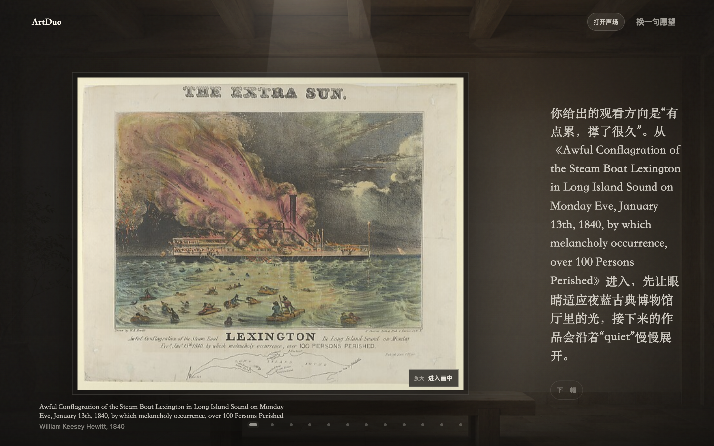
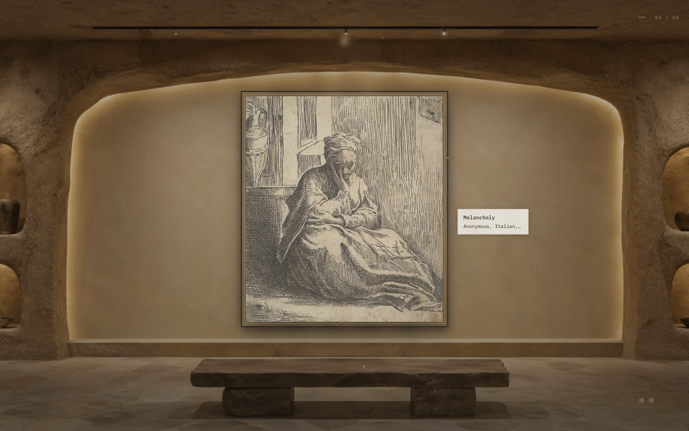
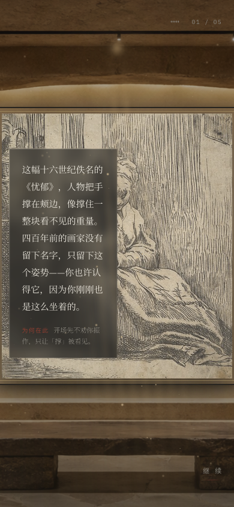

# ArtDuo experience 前端评估记录

评估日期：2026-10-01。

本文保存 2026-10-01 的前端对比、问题复现与截图。具体实施以 [experience 前端接入落地文档](../plans/artduo-v2-experience-integration-plan.md) 为准；评估结论不代表业务接入已经完成。

## 判断

建议采用 experience 作为 ArtDuo 下一版的视觉与叙事基准，正式运行继续落在 apps/web。它在情绪入口、展厅陈列、画作主次关系、前言与结语的连贯性上更贴合项目目标。现有前端的真实馆藏检索、场景匹配、详情、导航和媒体处理仍有继承价值。

不能仅把 MockGalleryDataSource 换成真实请求就宣布接入完成。当前存在协议差异、场景字段丢失、服务端渲染兼容、移动端裁切、错误恢复及导航缺口。

体验优势也有内容因素：experience 使用 12 件本地作品、6 个场景，以及 3 条关键词匹配的手写策展弧和 1 条兜底弧。正式前端同一输入返回 12 件检索结果。两者不是同一数据集和策展算法，不能用原型的观感证明真实检索质量已经提升。

## 范围和覆盖

采用 quick 主流程评估：输入 → 前言 → 五件作品 → 结语，另检查展签展开、键盘进入、减弱动效首间、手机视口及数据失败。对比基准是 apps/web，而非已经退出主运行路径的 frontend/。

技术结构：experience 是 React 19 + Vite + Tailwind 3 + GSAP + 原生 WebGL；apps/web 是 Next App Router，配合 packages/contracts、packages/corpus、packages/ui。

依据：项目 README、V2 重建需求、UX 状态矩阵、experience README、当前源码、浏览器实测。部分 README 的阶段状态已经落后于代码，例如当前已存在沉浸式页面，因此以实现核验为准。

| 领域 | 检查证据 | 结果 |
| --- | --- | --- |
| 可访问性 | 键盘进入、按钮语义、减弱动效分支、320/390px | 2 项 HIGH，见下表；完整读屏与焦点遍历未验证 |
| 布局 | 1440×900 桌面、390×844 与 320×740 手机视口 | 手机展签越界，归入可访问性阻塞 |
| 文案 | 入口、前言、展签、结语、失败状态 | 情绪表达较好；失败恢复缺失，1 项 HIGH |
| 排版 | 实际展签、输入、正文、作者截断 | 1 项 MEDIUM |
| 色彩 | 暖黑、暖白、朱砂与场景文字 token | 视觉检查已做；完整渲染对比度未测，不宣称全面通过 |
| 动效与细节 | 完整五件作品转场、前言、结语、指针视差实现 | 1 项 MEDIUM；减弱动效缺口归入可访问性 |

## 主要问题

| # | 级别 / 归属 | 位置与当前行为 | 建议及影响 |
| --- | --- | --- | --- |
| 1 | HIGH / 可访问性 | [Room.tsx:180](../../experience/src/sections/Room.tsx#L180)：右侧空间不足便把展签放左侧，没有检查左侧空间。390px 实测展签 x=-176、宽148；320px 也完全越界。 | 画作尺寸同时受可用宽高约束；手机改成底部展签或抽屉，保持可触达且不遮住画作。 |
| 2 | HIGH / 可访问性 | [Threshold.tsx:53](../../experience/src/sections/Threshold.tsx#L53)、[Preface.tsx:33](../../experience/src/sections/Preface.tsx#L33)、[Walk.tsx:154](../../experience/src/sections/Walk.tsx#L154)：进馆下沉、前言缩放、结尾缩放模糊未检查 reduced-motion，CSS 分支无法取消这些 JS 动画。 | 统一动效策略。减弱动效下去掉位移、缩放与景深，只留必要的淡入淡出。已有的视差降级值得保留。 |
| 3 | HIGH / 文案与恢复 | [useExperience.ts:49](../../experience/src/experience/useExperience.ts#L49)：数据请求和事件消费没有错误恢复；阻断 artworks.json 后实测停留空黑屏，无返回和重试文案。 | 补齐 pending/partial/ready/failed 与超时、取消、重试；保留已到达作品，给出恢复入口。 |
| 4 | MEDIUM / 动效节奏 | [datasource.ts:100](../../experience/src/lib/datasource.ts#L100)、[Preface.tsx:25](../../experience/src/sections/Preface.tsx#L25)：前言先完整流完，才发作品；再等待文字与退场，没有跳过入口。单次本地测试，提交到首间“继续”控件约6.87秒，尚未计入首间完整入场动画。 | 提交后即检索并准备首件；动画和数据准备并行。允许跳过前言，后续讲解异步补充。该单次耗时不是性能基准。 |
| 5 | MEDIUM / 排版 | [Plaque.tsx:50](../../experience/src/components/Plaque.tsx#L50)：作品标题11px、作者10px、年代9.5px；作者被截断，展开内容没有完整元数据替代入口。 | 保留展签比例和风格，同时提供可读的完整信息视图；核心控件扩大触达区域。 |

### 考虑后没有建议改动的部分

| 候选改动 | 不采纳原因 |
| --- | --- |
| 把诗意入口改回“策展意图”表单语言 | “此刻，你心里是什么天气？”与项目的情绪体验目标一致，保留更合适。 |
| 去掉全部 WebGL 和逐字叙事 | 这些是有效的体验资产，且部分已有静态降级；需要完善可选增强与性能边界。 |

## 验证记录

已通过：

- experience：npm run build（包含 tsc -b）通过。构建产物 JS 321.64KB/gzip109.26KB，CSS83.77KB/gzip14.60KB；这些不包括图片音频，不代表实际首屏总流量。
- packages/contracts：pnpm --filter @artduo/contracts build 通过。
- 浏览器实际走通 experience 的五件作品到结语，展开首幅展签；另以键盘进入，并验证 reduced-motion 下首间能显示静态画作。
- 使用相同输入“有点累，撑了很久”查看正式前端首页与真实12件作品观展页面。现有页面能显示，但长英文作品名进入叙事正文，实测样本中占据大量空间；内容适配需要随接入一起处理。
- 手机展签越界和作品数据失败黑屏均已复现。

未验证：完整读屏、200%缩放、全场景对比度、音频实听、分享下载成品、真实手机性能、全部情绪分支、完整生产构建与全仓库回归。未修改业务源码，未提交、推送或发布。

环境说明：工作区最初缺少安装依赖。冻结锁文件安装发现 packages/ui 清单与锁文件不一致；为本地评估安装了忽略脚本且不写锁文件的依赖，因此不能把本次启动视为干净CI安装通过。正式接入应同步修复依赖清单与锁文件一致性。本次没有修改它们。

## 截图证据

以下截图均来自本次本地浏览器评估；正式前端和原型使用同一句输入，但数据来源与策展算法不同。

### 当前正式前端：真实数据观展

### experience：桌面展厅

### experience：手机布局问题

390px 视口中画作超出可用宽度，展签按钮位于视口之外；图中的说明面板是在桌面展开后缩窄视口的状态，并不代表手机用户能触达已经越界的展签。

## 参考资料

- [项目说明](../../README.md)
- [V2 重建需求](../brainstorms/artduo-v2-lightweight-rebuild-requirements.md)
- [UX 流程与状态矩阵](../specs/artduo-v2-ux-flow-and-state-matrix.md)
- [共享契约与 API 规范](../specs/artduo-v2-shared-contracts-and-api.md)
- [背景场景规范](../specs/artduo-v2-background-scene-schema.md)
- [experience 原型说明](../../experience/README.md)

## 评审结论

**Block（直接替换上线）**：已有 HIGH 问题未解决。设计方向值得采用；正式接入按落地文档的模块边界完成，保留新版的完整体验目标。
